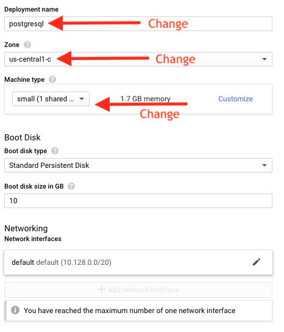
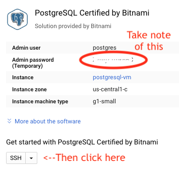
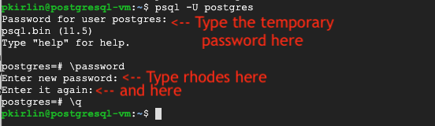

# Setting up Google Cloud

 1. Follow the link in Professor Kirlin's email to activate your $50 in credit for Google Cloud Platform (GCP).
 2. Once you are done, you can go to cloud.google.com and you can click **Console** in the upper-right corner.  This will bring you to the main GCP page.
 
## Make a new GCP Project and enable billing
 
 1. Go to the Manage resources page in the GCP console: ([link](https://console.cloud.google.com/cloud-resource-manager)).
 2. Click **Create Project**.
 3. In the **New Project** window that appears, enter the project name **db-f19** and select the billing account for this class (COMP340 most likely).
 4. When you're finished entering new project details, click **Create**.
 5. The project creation will take a few seconds.
 
## Creating a PostgreSQL database

1. We will launch a Linux machine in the cloud running PostgreSQL.  [Click here](https://console.cloud.google.com/marketplace/details/bitnami-launchpad/postgresql).
2. Click **Launch on Compute Engine**.
3. Choose the **db-f19** project.
3. On the next screen, choose the following options:
	* For Deployment name, choose the name **postgresql**.  (Remove the "-1" at the end).
	* For Zone, choose **us-central1-c**.
	* For Machine Type, pick **small** (1 shared vCPU, 1.7 GB memory).
	* Under Boot Disk, and Networking, leave everything alone.
	
4. Click the blue **Deploy** button.
5. The machine will be set up and initialized, which might take a few minutes.  Eventually you will see a green checkbox with the message that your machine has been deployed.

	
6. Take note of the master password to the right:

	

## Changing the database master password
Right now the default password for your PostgreSQL server is a randomly-generated password that is hard to remember.  We're going to set the
password to something easier to remember (though not very secure, but 
that's ok for this class).

1. Click on the "SSH" button in the right-hand panel.  A new window
	will open, and after a few seconds, you will be logged into your 
	PostgreSQL server.  Don't worry too much about this screen as we won't
	be using it much again (if ever).  We just need to change the password.
2. At the prompt, type the following command (exactly):

 	`psql -U postgres`
 	
	and press ENTER.  `psql` is the command that lets you interact directly
	with the PostgreSQL server.
	
3. You will be prompted for your existing password.  Copy and paste the password from your web browser window.
4. You will be logged in.  Now type the command:

	`\password`
	
	and press ENTER.
	
5. Enter a new password of `rhodes` twice.  I want everyone to use
	the same password so nobody will forget.
6. Quit `psql` with the command:

	`\q` 
	
	and press ENTER.

	
	
7. Now type `logout` and press ENTER.  The window will close.

## Now you can move on to setting up your Linux environment.

Go to the next part of the lab.
