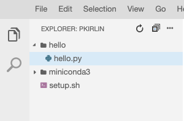

# Setting up Linux on Google Cloud

The next step is to get familiar with the Linux environment on the Google Cloud Platform (GCP).

## Set up the GCP Cloud Shell
1. Go to the [GCP dashboard](https://console.cloud.google.com/home/dashboard). This is where you will always start from.
2. Click on the **Activate Cloud Shell** button in the upper right corner.  It looks like this: 
3. The Cloud Shell window opens below after a few seconds.  This is a Linux machine running in the cloud that we will program on.  We need to install some software to get started. 
4. At the prompt, copy and paste the following command:

  `wget http://www.cs.rhodes.edu/~kirlinp/courses/db/f19/setup.sh`
  
  Press ENTER.
  
5. Then run the following command:

  `bash setup.sh`  (press ENTER after typing this)
  
6. At the end you will need to log out and log back in again to Cloud Shell.

## Familiarizing yourself with Linux 

**If you already know Linux you can skip this section and go straight to "Writing and running a simple Python program" below**

1. Linux is a command-line based operating system (though there are graphical interfaces that can run on top of it).  That means the primary way to interact with the operating system is through typing commands.  
2. The "prompt" in the Linux shell is where you type the commands.    Take a look at the prompt (it will look slightly different for you):
  
  `pkirlin@cloudshell:~ (db-f19)$`
  
  The first part, pkirlin, is your login name.  This will be different for you.
  
  The next part, cloudshell, is the name of the computer you are logged in to.
  
  The next part, after the colon, tells us our **current directory**.  This
  is the directory that all our commands will run in.  Right now we are
  in our **home directory**, which is abbreviated as a tilde (`~`).
  
  The next part is specific to GCP, and it tells us our current project (db-f19).
  
3. Here are some command Linux commands:

	`ls` List files
	
	`ls -l` List files with extra info (that's a lowercase 'L' at the end, not a the number one)
	
	`cd` Return to your home directory
	
	`cd dirname` Change directory
	
	`mkdir dirname` Make a new directory
	
	`rmdir dirname` Remove (delete) a directory (it must be empty).
	
	`mv file1 file2` Move (rename) file1 to file2
	
	`cp file1 file2` Copy a file to a new file.
	
	`rm file` Remove a file
	
	`more file` Look at a text file.

	Let's look at the files in our home directory.  Type:

	`ls -l` and press ENTER.  We see a list of our files.
	
## Writing and running a simple Python program

1. Let's make a new directory to experiment.  Type the command:

	`mkdir hello`
	
2. Now type:

	`cd hello`
	
	Notice how our prompt changes to reflect that we are now in the 
	newly-created hello directory.
	
3. Luckily, GCP has a visual code editor!  Let's open it.  Click the image of a pencil near the top of the shell.  The visual editor opens!
4. Choose File -> New.  Name the file hello.py.  Make sure the file is in the hello directory (drag it into the hello directory in the left panel listing all your files).

	
	
5. In the code area, type `print("Hello world!")`.  The file will be saved automatically, but you can choose File-> Save to be sure.
6. Back in the Linux shell, type `python hello.py`.  You should see your hello world message!  Now you know how to run Python programs.
7. Type `cd` to go back to your home directory.  Your prompt should change back to just a tilde `~` (the hello part should disappear).

## Now it's time to get acquainted with Flask!
Go to the next part of the lab.
	
  
  
